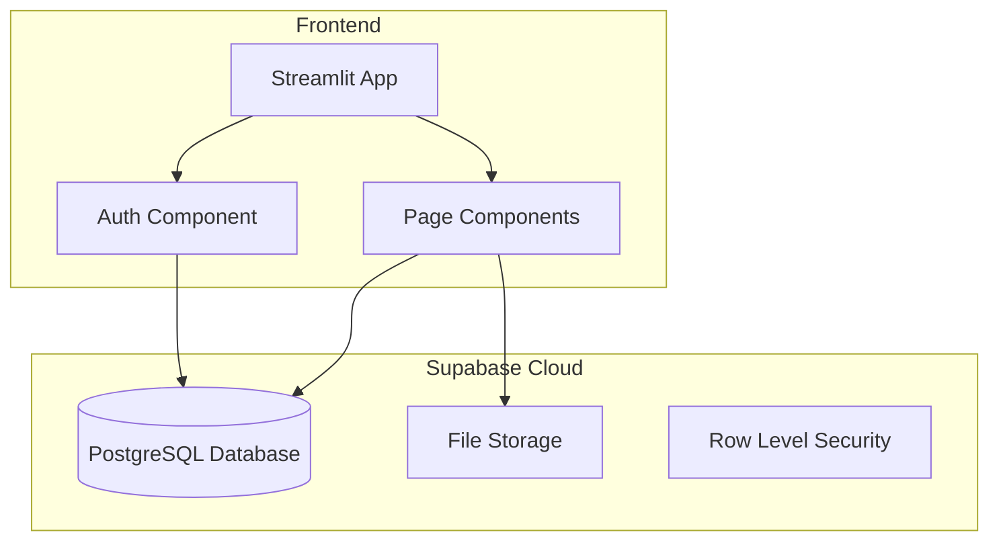

# 🎓 Assignment Platform

A modern assignment submission and grading platform built with Streamlit and Supabase.


## 🌟 Features

### For Students
- 📤 **Submit Assignments** - Upload PDF, DOCX, or PPTX files
- 📊 **Dashboard** - Track submission status and deadlines
- 📈 **View Grades** - See marks and feedback from instructors

### For Admins/Instructors
- 📝 **Manage Assignments** - Create, edit, and delete assignments
- ✅ **Grade Submissions** - Review files and provide marks/feedback
- 📊 **Admin Dashboard** - Overview of all submissions and statistics

## 🏗️ Architecture



## 🛠️ Tech Stack

| Component | Technology | Purpose |
|-----------|------------|---------|
| **Frontend** | Streamlit | Interactive web UI |
| **Database** | Supabase (PostgreSQL) | Data persistence |
| **File Storage** | Supabase Storage | Assignment file uploads |
| **Authentication** | JWT + Argon2 | Secure user auth |
| **Styling** | Custom CSS | Modern UI design |
| **Charts** | Plotly | Data visualization |

## 📁 Project Structure

```
ai-progress-tracker/
├── frontend/                   # Streamlit application
│   ├── app.py                 # Main entry point
│   ├── config.py              # Configuration
│   ├── requirements.txt       # Python dependencies
│   ├── .streamlit/
│   │   └── secrets.toml       # Supabase credentials
│   ├── components/            # Reusable UI components
│   │   ├── auth.py           # Login/Register forms
│   │   ├── sidebar.py        # Navigation sidebar
│   │   ├── file_preview.py   # File preview component
│   │   └── grading.py        # Grading form component
│   ├── pages/                 # Streamlit pages
│   │   ├── 1_Admin_Dashboard.py
│   │   ├── 1_Student_Dashboard.py
│   │   ├── 2_Manage_Assignments.py
│   │   ├── 2_Submit_Assignment.py
│   │   ├── 3_My_Grades.py
│   │   └── 3_Review_Submissions.py
│   └── utils/                 # Utility modules
│       ├── database.py       # Supabase client
│       ├── supabase_api.py   # API operations
│       ├── rbac.py           # Role-based access
│       └── session.py        # Session management
└── backend/                   # (Legacy - not needed)
```

## 🚀 Quick Start

### Prerequisites
- Python 3.9+
- Supabase account

### 1. Clone & Install

```bash
git clone https://github.com/yourusername/ai-progress-tracker.git
cd ai-progress-tracker/frontend
pip install -r requirements.txt
```

### 2. Configure Supabase

Create `.streamlit/secrets.toml`:
```toml
SUPABASE_URL = "your-supabase-url"
SUPABASE_KEY = "your-supabase-anon-key"
JWT_SECRET = "your-jwt-secret"
```

### 3. Database Setup

Run this SQL in Supabase SQL Editor:

```sql
-- Users table
CREATE TABLE users (
    id SERIAL PRIMARY KEY,
    email VARCHAR(255) UNIQUE NOT NULL,
    name VARCHAR(255) NOT NULL,
    password_hash TEXT NOT NULL,
    role VARCHAR(20) DEFAULT 'student',
    created_at TIMESTAMP DEFAULT NOW()
);

-- Assignments table
CREATE TABLE assignments (
    id SERIAL PRIMARY KEY,
    title VARCHAR(255) NOT NULL,
    description TEXT,
    due_date TIMESTAMP,
    max_marks INTEGER DEFAULT 100,
    created_by INTEGER REFERENCES users(id),
    created_at TIMESTAMP DEFAULT NOW()
);

-- Submissions table
CREATE TABLE submissions (
    id SERIAL PRIMARY KEY,
    student_id INTEGER REFERENCES users(id),
    assignment_id INTEGER REFERENCES assignments(id),
    file_path TEXT NOT NULL,
    file_type VARCHAR(10),
    status VARCHAR(20) DEFAULT 'pending',
    submitted_at TIMESTAMP DEFAULT NOW()
);

-- Reviews table
CREATE TABLE reviews (
    id SERIAL PRIMARY KEY,
    submission_id INTEGER REFERENCES submissions(id),
    reviewer_id INTEGER REFERENCES users(id),
    marks INTEGER,
    feedback TEXT,
    created_at TIMESTAMP DEFAULT NOW()
);
```

### 4. Create Storage Bucket

1. Go to Supabase Dashboard → Storage
2. Create bucket named `submissions`
3. Set as public or configure RLS

### 5. Run the App

```bash
cd frontend
streamlit run app.py
```

Visit `http://localhost:8501` 🎉

## ☁️ Deployment (Streamlit Cloud)

1. Push code to GitHub
2. Go to [share.streamlit.io](https://share.streamlit.io)
3. Connect your repository
4. Set secrets in dashboard:
   - `SUPABASE_URL`
   - `SUPABASE_KEY`
   - `JWT_SECRET`

## 📸 Screenshots

| Login Page | Student Dashboard | Admin Grading |
|------------|-------------------|---------------|
| 🔐 Secure authentication | 📊 Track submissions | ✅ Grade with feedback |

## 🔒 Security Features

- **Password Hashing**: Argon2 (winner of Password Hashing Competition)
- **JWT Tokens**: Secure session management with 7-day expiry
- **Role-Based Access**: Students/Admins see different pages
- **Signed URLs**: Secure file access with expiring links

## 📄 License

MIT License - feel free to use for educational purposes!

---

Made with ❤️ using Streamlit & Supabase
