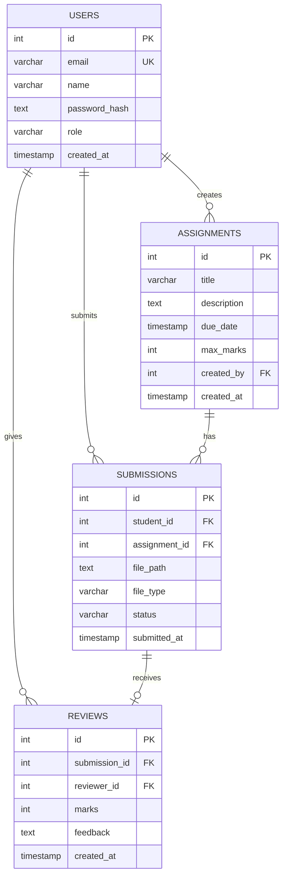

# Database Schema

SQL schema for Supabase PostgreSQL database.

## 🗄️ Entity Relationship Diagram



## 📋 Tables

### Users
Stores all user accounts (students and admins).

```sql
CREATE TABLE users (
    id SERIAL PRIMARY KEY,
    email VARCHAR(255) UNIQUE NOT NULL,
    name VARCHAR(255) NOT NULL,
    password_hash TEXT NOT NULL,
    role VARCHAR(20) DEFAULT 'student',
    created_at TIMESTAMP DEFAULT NOW()
);

CREATE INDEX idx_users_email ON users(email);
```

### Assignments
Assignment definitions created by admins.

```sql
CREATE TABLE assignments (
    id SERIAL PRIMARY KEY,
    title VARCHAR(255) NOT NULL,
    description TEXT,
    due_date TIMESTAMP,
    max_marks INTEGER DEFAULT 100,
    created_by INTEGER REFERENCES users(id),
    created_at TIMESTAMP DEFAULT NOW()
);
```

### Submissions
Student assignment submissions with file references.

```sql
CREATE TABLE submissions (
    id SERIAL PRIMARY KEY,
    student_id INTEGER REFERENCES users(id),
    assignment_id INTEGER REFERENCES assignments(id),
    file_path TEXT NOT NULL,
    file_type VARCHAR(10),
    status VARCHAR(20) DEFAULT 'pending',
    submitted_at TIMESTAMP DEFAULT NOW(),
    
    UNIQUE(student_id, assignment_id)
);

CREATE INDEX idx_submissions_student ON submissions(student_id);
CREATE INDEX idx_submissions_status ON submissions(status);
```

### Reviews
Grades and feedback for submissions.

```sql
CREATE TABLE reviews (
    id SERIAL PRIMARY KEY,
    submission_id INTEGER REFERENCES submissions(id) UNIQUE,
    reviewer_id INTEGER REFERENCES users(id),
    marks INTEGER,
    feedback TEXT,
    created_at TIMESTAMP DEFAULT NOW()
);
```

## 🔐 Row Level Security (Optional)

```sql
-- Enable RLS
ALTER TABLE submissions ENABLE ROW LEVEL SECURITY;

-- Students can only see their own submissions
CREATE POLICY "Students view own submissions" ON submissions
    FOR SELECT USING (auth.uid()::int = student_id);

-- Admins can see all
CREATE POLICY "Admins view all" ON submissions
    FOR ALL USING (
        EXISTS (SELECT 1 FROM users WHERE id = auth.uid()::int AND role = 'admin')
    );
```

## 📦 Storage Bucket

Create a bucket named `submissions` in Supabase Storage:

```
Bucket: submissions
├── {user_id}_{assignment_id}_{uuid}_{filename}.pdf
├── {user_id}_{assignment_id}_{uuid}_{filename}.docx
└── ...
```
