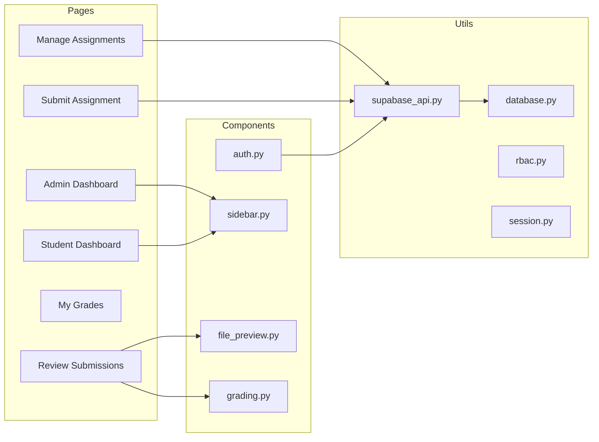

# Frontend - Streamlit Application

The main web application built with Streamlit.

## 🏗️ Component Architecture



## 📁 Directory Structure

```
frontend/
├── app.py                  # Main entry, auth check, routing
├── config.py               # App configuration
├── requirements.txt        # Dependencies
│
├── .streamlit/
│   ├── config.toml        # Streamlit settings
│   └── secrets.toml       # Supabase credentials (local)
│
├── components/
│   ├── __init__.py
│   ├── auth.py            # Login/Register forms
│   ├── sidebar.py         # Navigation component
│   ├── file_preview.py    # PDF/file viewer
│   └── grading.py         # Mark allocation form
│
├── pages/
│   ├── 1_Admin_Dashboard.py     # Admin overview
│   ├── 1_Student_Dashboard.py   # Student overview
│   ├── 2_Manage_Assignments.py  # CRUD assignments
│   ├── 2_Submit_Assignment.py   # File upload
│   ├── 3_My_Grades.py           # View grades
│   └── 3_Review_Submissions.py  # Grade submissions
│
└── utils/
    ├── __init__.py
    ├── database.py        # Supabase client init
    ├── supabase_api.py    # All database operations
    ├── rbac.py            # Role-based access control
    └── session.py         # Cookie management
```

## 🔧 Key Files

### `supabase_api.py`
Central API client with all database operations:
- **Auth**: `register()`, `login()`, `get_user()`
- **Assignments**: `list_assignments()`, `create_assignment()`, `delete_assignment()`
- **Submissions**: `list_submissions()`, `submit_assignment()`
- **Reviews**: `create_review()`
- **Files**: `get_file_url()`

### `rbac.py`
Role-based access control:
- Restricts pages based on user role (student/admin)
- Hides default Streamlit navigation

### `session.py`
Cookie-based session management:
- Persists login across page refreshes
- Uses `extra-streamlit-components` CookieManager

## 🎨 UI Components

| Component | Description |
|-----------|-------------|
| `auth.py` | Login/Register forms with validation |
| `sidebar.py` | Role-aware navigation menu |
| `file_preview.py` | PDF viewer in iframe, download links for DOCX/PPTX |
| `grading.py` | Mark input, feedback textarea, quick feedback buttons |

## 📦 Dependencies

| Package | Version | Purpose |
|---------|---------|---------|
| streamlit | ≥1.30.0 | Web framework |
| supabase | ≥2.0.0 | Database client |
| argon2-cffi | ≥21.0.0 | Password hashing |
| python-jose | ≥3.3.0 | JWT handling |
| plotly | latest | Charts |
| extra-streamlit-components | ≥0.1.70 | Cookie management |

## 🚀 Running Locally

```bash
# From frontend directory
pip install -r requirements.txt
streamlit run app.py
```

## 🔐 Environment Variables

Set in `.streamlit/secrets.toml`:

```toml
SUPABASE_URL = "https://xxx.supabase.co"
SUPABASE_KEY = "eyJ..."
JWT_SECRET = "your-secret-key"
```

For Streamlit Cloud, set these in the dashboard secrets.
